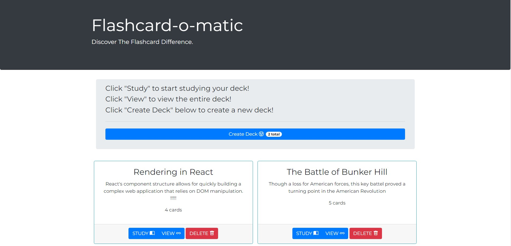

### Flash Card App

An application that allows users to create flash cards and quiz themselves. This project uses React and Bootstrap styling.

## Features

- Users can create, delete, and edit flash cards
- Users can quiz themselves on their flash cards
- Flash cards are organized by decks and each deck can be viewed individually
- Decks can be deleted and edited
- Safegaurds are in place to prevent users from accidentaly deleting decks with cards in them and cards with no content.
